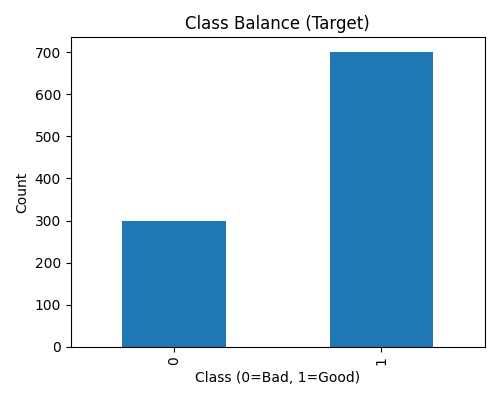
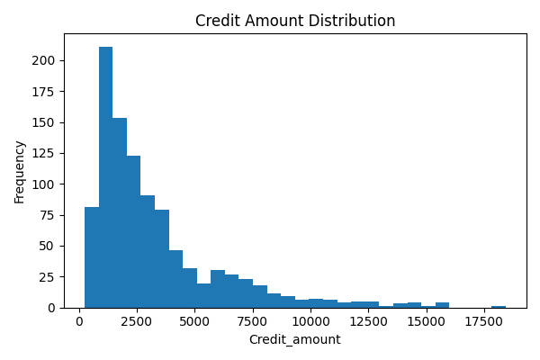
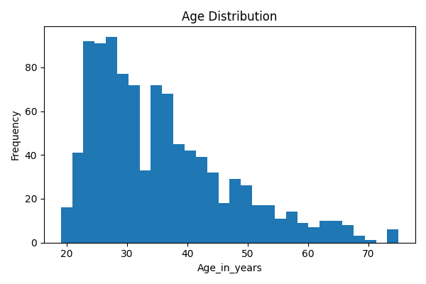
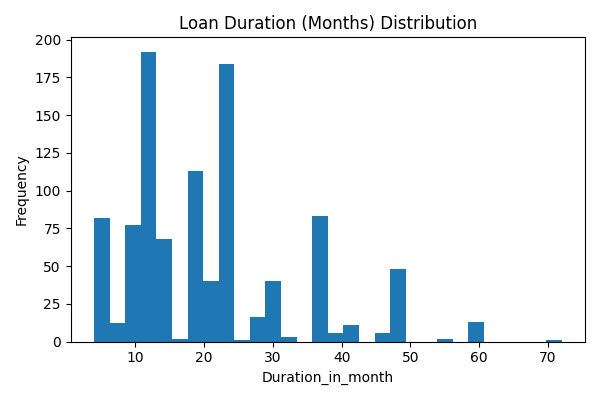
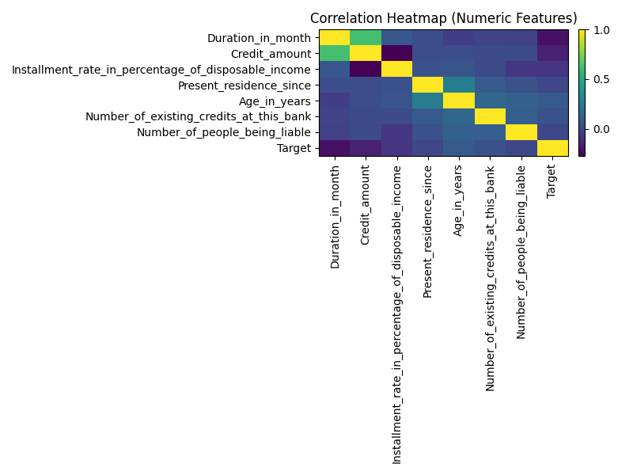

# Kreditrisiko-Bewertung-mit-Machine-Learning
Im Rahmen des Projekts wurde eine Machine-Learning-Pipeline zur Vorhersage der Kreditwürdigkeit auf Basis des German Credit Dataset entwickelt. Sie umfasst Datenaufbereitung, Modelltraining, Explainable AI, Bereitstellung via REST-API und Visualisierung im Dashboard – von Analyse bis Produktion.
Hauptfunktionen
📊 Explorative Datenanalyse (EDA)

Visualisierungen zur Klassenverteilung, Merkmalverteilungen und Korrelationen.
Einblicke in demografische Daten von Kreditnehmern und Kreditmerkmale.

⚙️ Datenvorverarbeitung

One-Hot-Encoding für kategoriale Variablen.
Skalierung und Merkmalsauswahl mit StandardScaler und SelectKBest.

🧠 Machine-Learning-Modelle

Logistische Regression, Entscheidungsbäume, Random Forests, Gradient Boosting, SVM.

Hyperparameter-Tuning mit GridSearchCV.
Modellvergleich anhand von Genauigkeit, Konfusionsmatrix und Klassifikationsberichten.

🔍 Modellinterpretierbarkeit

Feature-Importance-Plots für Random Forests.
SHAP (SHapley Additive exPlanations) für globale und lokale Modellerklärungen.

💾 Modell-Speicherung

Speichern trainierter Modelle, Skalierer, Selektoren und Feature-Sets mit joblib.

🌐 Bereitstellung

Flask-API für Echtzeit-Kreditrisikovorhersagen (/predict-Endpoint).
Streamlit-Dashboard für interaktive Vorhersagen ohne Programmierkenntnisse.

📂 Projektstruktur

Separate Skripte für Training, Visualisierung, API-Hosting und Tests.
Assets-Ordner mit allen generierten Diagrammen zur Dokumentation.
Technologie-Stack
Python: Zentrale Programmiersprache für Datenverarbeitung und Modellierung.

Bibliotheken:
pandas, numpy, matplotlib, scikit-learn, shap, flask, streamlit

Bereitstellung: Flask REST API, Streamlit Benutzeroberfläche.
pandas, numpy, matplotlib, scikit-learn, shap, flask, streamlit

Bereitstellung: Flask REST API, Streamlit Benutzeroberfläche.

## 📊 Visuals (Preview)

  
  

  
  

  

